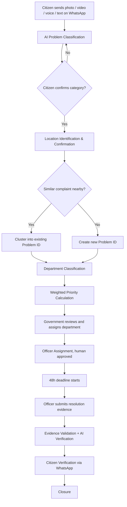

<div align="center">

# 🌉 JanaSetu

### *A transparent bridge between citizens and government.*

**Report on WhatsApp. Track in one link. Verified by AI and by people.**


[Overview](#-overview) · [Features](#-key-features) · [How It Works](#-how-it-works) · [Architecture](#-architecture) · [Getting Started](#-getting-started) · [Roadmap](#-roadmap)

</div>

---

## 📖 Overview

**JanaSetu** (*Jana* = people, *Setu* = bridge) is a citizen-to-government civic problem management platform. Citizens report everyday problems such as potholes, drainage and sewer leaks, garbage build-up, water-pipeline leakage, contaminated water, broken streetlights, and damaged public infrastructure through **WhatsApp**, with no heavy app, no confusing dashboards, and no pile of buttons.

Behind the chat, JanaSetu combines **multimodal AI, location verification, complaint clustering, department routing, weighted prioritisation, transparent tracking, and AI-assisted resolution verification** so that government teams can answer the questions that usually go unanswered:

| Question | How JanaSetu answers it |
|---|---|
| Which department is responsible? | AI department classification |
| What should be handled first? | Department-aware, weighted priority scoring |
| Which complaints are the same issue? | Duplicate detection and clustering |
| Who should fix it? | Officer-assignment suggestions (human-approved) |
| Was it *actually* fixed? | AI verification and citizen verification |
| What if it's reported again? | Historical lookup and officer reassignment |
| How does the citizen know what's happening? | One shared, public tracking link per problem |

> **Citizens** interact through **WhatsApp**. **Government and department officers** work in dedicated **dashboards**.

---

## ✨ Key Features

### 👥 For Citizens
- 📱 **WhatsApp-first reporting**: send a photo, video, voice note, text, or any combination
- 🗣️ **Multilingual**: voice notes in regional languages are transcribed and understood
- ✅ **Confirm before it's filed**: the AI proposes a category and location, and the citizen approves both
- 🔗 **One problem = one tracking link**: everyone reporting the same issue follows the same progress page
- 🔔 **WhatsApp updates** at every stage, plus a final *"Was it really fixed?"* check

### 🏛️ For Government & Departments
- 🧠 **Automatic department routing** (Water, Sewerage, Roads/PWD, Sanitation, Electricity/Streetlight, etc.)
- 📊 **Priority queues per department** using configurable factors and fixed weightages
- 📄 **Downloadable evidence reports**: photos, GPS, linked-complaint count, population impact, score breakdown
- 👷 **Smart officer suggestions** based on availability, workload, location, and expertise
- ⏱️ **48-hour resolution deadline** with a human-reviewed extension workflow
- 🗂️ **Officer accountability history** that supports human decisions without auto-punishing anyone

### 🛡️ Anti-Fraud & Integrity
- 🚫 **Evidence upload ≠ resolution**: uploading a file never stops the clock by itself
- 🔍 **Two-layer evidence check**: location verification, then AI relevance and quality analysis
- 🧑‍⚖️ **Human-first verification**: valid citizen feedback outranks AI, and AI never silently overrides a "NO"
- 🔁 **Repeat-failure protection**: a problem that recurs is never reassigned to the same officer

---

## 🔄 How It Works



### 1️⃣ Report
A citizen sends a photo, video, voice note, or text. Voice goes through *Speech-to-Text → Language Understanding → Classification*. Images and video are analysed directly.

### 2️⃣ Confirm
> *"We identified this as a road/pothole problem. Is this correct?"*

Nothing becomes an official complaint until the citizen says **Yes**. The same applies to the location, whether it was shared as live location, GPS, a landmark, a nearby shop, an intersection, or a voice description.

### 3️⃣ Cluster
Three people reporting *"pipe leaking near XYZ Market"* in three different ways become **one** problem instance. The number of reporters is kept as a **priority signal**, and every reporter receives the same tracking link.

### 4️⃣ Route and Prioritise
Complaints are first routed to the responsible department, then ranked **within that department** using configurable factors:

- Number of linked complaints
- Estimated population affected
- Severity
- Geographic impact
- Duration of the problem
- Other government-defined factors

There is no single global queue. Each department gets its own, with a transparent score breakdown.

### 5️⃣ Assign and Resolve
Government reviews the prioritised list and assigns it to departments. The system suggests an available officer, and an authorised human makes the final call. The officer also receives AI-generated resolution recommendations (equipment, manpower, cost, and time estimates drawn from similar past cases).

### 6️⃣ Verify, Not Just Upload
When an officer claims the work is done, JanaSetu verifies the **outcome** and not merely the existence of a file:

```
Officer submits evidence
        │
        ├─ Camera capture via portal ─► location check ─┐
        └─ Gallery upload ──────────────────────────────┤
                                                        ▼
                         AI analysis (always runs, pass or fail on location)
                         • Is it the same problem and place?
                         • Is it blank, black, vague, or unusable?
                         • Is it duplicated or suspicious?
                         • Are the before and after photos consistent?
                                                        ▼
                         Citizen verification via WhatsApp (YES / NO)
                                                        ▼
                                                    Closure
```

### 7️⃣ Human + AI Decision Matrix

| Case | AI says | Citizen says | Outcome |
|:---:|:---:|:---:|---|
| 1 | Resolved | ✅ Yes | **Resolution confirmed** |
| 2 | Resolved | ❌ No | Citizen evidence triggers review or **reopening** |
| 3 | Not resolved | ✅ Yes | Citizen confirmation considered per configured policy |
| 4 | Resolved | ⏳ No response | Closed after the predefined response window |
| 5 | Not resolved | ⏳ No response | **Stays open** until the AI reports resolved |

> **Principle:** human confirmation takes priority, and AI acts as an additional layer and as a fallback when no human response arrives.

---

## 🔗 One Problem, One Tracking Link

```
 Citizen A ─┐
 Citizen B ─┼──►  Problem ID: SV-XXXX  ──►  One Tracking Link
 Citizen C ─┘
```

The public tracking page shows the problem category, general location, responsible department, assigned officer and designation (where legally permitted), assignment date, expected resolution time, current stage, work updates, shareable evidence, AI and citizen verification status, and escalation and closure status.

🔒 **Privacy by design:** the page shows the *status of the problem*, never other citizens' personal information. Sensitive or legally restricted data is never exposed.

---

## 🧱 Architecture

```
┌───────────────┐      ┌──────────────────────────────────────────────────┐
│   Citizen     │      │                  JanaSetu Backend                │
│  (WhatsApp)   │◄────►│                                                  │
└───────────────┘      │  Ingestion ─► Multimodal AI ─► Classification    │
                       │                    │                             │
┌───────────────┐      │  Location Service  │   Clustering Engine         │
│ Tracking Page │◄─────│  Priority Engine   │   Dept. Router              │
│   (public)    │      │  Assignment Engine │   Verification Engine       │
└───────────────┘      │  Notification Svc  │   Accountability Ledger     │
                       └───────────────┬──────────────────────────────────┘
┌───────────────┐                      │
│ Govt / Dept   │◄─────────────────────┘
│  Dashboards   │         Database · Object Storage · Audit Logs
└───────────────┘
```

| Module | Responsibility |
|---|---|
| **Ingestion** | Receive WhatsApp text, images, video, and voice |
| **Multimodal AI** | Speech-to-text, language understanding, image/video classification |
| **Location Service** | GPS, landmark, and address resolution and confirmation |
| **Clustering Engine** | Detect duplicate and similar complaints by place, type, and time |
| **Department Router** | Map problem categories to responsible departments |
| **Priority Engine** | Weighted, configurable, department-aware scoring |
| **Assignment Engine** | Suggest officers based on workload, expertise, and history |
| **Verification Engine** | Location and AI evidence checks, plus citizen feedback logic |
| **Notification Service** | WhatsApp updates and tracking-link delivery |
| **Accountability Ledger** | Full evidence trail and officer performance history |

### 🧰 Suggested Tech Stack

> The stack below is a proposal and can be swapped for your own choices.

| Layer | Suggested Technology |
|---|---|
| Messaging | WhatsApp Business Cloud API |
| Backend | Python (FastAPI) or Node.js |
| AI / ML | Multimodal LLM, speech-to-text, vision models, embedding-based clustering |
| Database | PostgreSQL + PostGIS (geospatial queries) |
| Storage | S3-compatible object storage |
| Queue | Redis / Celery |
| Dashboards | React + Tailwind CSS |
| Maps | OpenStreetMap / Leaflet |
| Deployment | Docker + CI/CD |

---

## 🚀 Getting Started

### Prerequisites
- Python 3.11+ / Node.js 18+
- PostgreSQL 15+ with PostGIS
- A WhatsApp Business API account
- API keys for your chosen AI provider

### Installation

```bash
# 1. Clone the repository
git clone https://github.com/your-org/janasetu.git
cd janasetu

# 2. Configure environment
cp .env.example .env
# Fill in WhatsApp, database, and AI provider credentials

# 3. Install dependencies
pip install -r requirements.txt

# 4. Run database migrations
alembic upgrade head

# 5. Start the backend
uvicorn app.main:app --reload

# 6. Start the dashboard
cd dashboard && npm install && npm run dev
```

### Environment Variables

| Variable | Description |
|---|---|
| `WHATSAPP_TOKEN` | WhatsApp Business API access token |
| `WHATSAPP_VERIFY_TOKEN` | Webhook verification token |
| `DATABASE_URL` | PostgreSQL connection string |
| `AI_API_KEY` | AI provider API key |
| `STORAGE_BUCKET` | Object storage bucket for evidence |
| `TRACKING_BASE_URL` | Base URL for public tracking links |
| `RESPONSE_WINDOW_HOURS` | Citizen verification window before auto-closure |
| `RESOLUTION_DEADLINE_HOURS` | Default task deadline (default: `48`) |

### ⚙️ Configurable Policy

Government bodies can tune platform behaviour without code changes:

- Priority factors and their **weightages** (per department)
- Citizen verification **response window**
- Resolution **deadline** and extension rules
- Fields shown on the **public tracking page**
- Escalation rules

---

## 📂 Project Structure

```
janasetu/
├── app/
│   ├── ingestion/        # WhatsApp webhook, media handling
│   ├── ai/               # Classification, speech, vision, verification
│   ├── clustering/       # Duplicate / similar complaint detection
│   ├── routing/          # Department classification
│   ├── priority/         # Weighted priority engine
│   ├── assignment/       # Officer suggestion logic
│   ├── tracking/         # Public tracking pages
│   ├── accountability/   # Officer history and audit trail
│   └── main.py
├── dashboard/            # Government and department dashboards
├── docs/                 # Solution documentation
├── tests/
├── .env.example
└── README.md
```

---

## 🔐 Principles & Safeguards

- **Human in the loop**: extensions, final assignments, and disciplinary decisions stay with authorised humans, and AI recommends but never punishes.
- **Outcome over upload**: evidence submission and resolution verification are separate steps.
- **Citizen voice wins**: AI never silently overrides an active "not resolved" response.
- **Privacy first**: personal and legally restricted information is never shown publicly.
- **Full audit trail**: every step from original evidence to closure is recorded.
- **Penalties follow government rules**: any action follows applicable service regulations.

---

## 🔁 Never the Same Failure Twice

If the AI wrongly marks a problem as resolved *and* the citizen never responds, the complaint may close while the problem persists. JanaSetu is built so that this can only happen **once**:

1. A recurring complaint is **not** treated as brand new. The system checks the historical record: previous complaint, location, original and resolution evidence, previous officer, citizen verification, new evidence, and time gap.
2. The same officer is **not** automatically reassigned to the recurring problem.
3. Reassignment accounts for past unresolved and reopened cases.

> ### *"Even in the worst case, we fail only once and never let it happen again."*

---

## 🗺️ Roadmap

- [x] Solution design and workflow definition
- [ ] WhatsApp ingestion (text, image, video, voice)
- [ ] AI classification with citizen confirmation
- [ ] Location capture and verification
- [ ] Duplicate detection and clustering
- [ ] Department routing and priority engine
- [ ] Government and department dashboards
- [ ] Officer assignment and AI recommendations
- [ ] Public shared tracking page
- [ ] Resolution verification (location + AI)
- [ ] Citizen verification loop
- [ ] Officer accountability history
- [ ] Multi-city pilot

---

## 🤝 Contributing

Contributions are welcome!

1. Fork the repository
2. Create a feature branch: `git checkout -b feature/amazing-feature`
3. Commit your changes: `git commit -m "Add amazing feature"`
4. Push to the branch: `git push origin feature/amazing-feature`
5. Open a Pull Request

Please read `CONTRIBUTING.md` before submitting.

---

## 📜 License

Distributed under the MIT License. See `LICENSE` for details.

---

<div align="center">

**Built so that every citizen's voice reaches the right desk and stays visible until the problem is truly solved.**

🌉 **JanaSetu**: *Citizens ↔ Government, with transparency in between.*

</div>